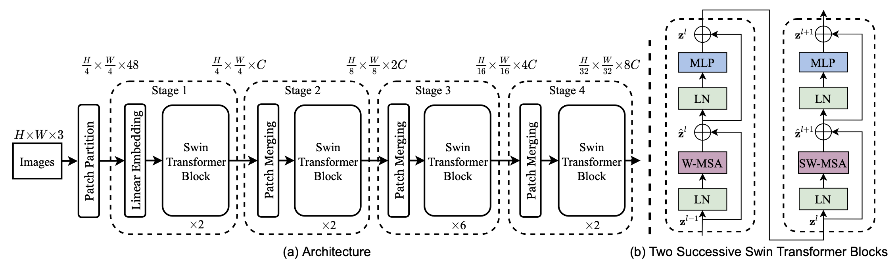

### Accuracy Aligned. Concise Implementation of Swin Transformer

This repository contains the implementation of [Swin Transformer](https://arxiv.org/abs/2103.14030), and the training codes on ImageNet datasets. We have aligned the output of our network with the official one, that is, using the same input and random seed, the output is identical to the official one.

Our implementation is highly based on einops, which makes the implementation more concise, and easy to be understand. (Intuitively, we use only 200 lines of codes compared with ~600 lines of official codes.) Besides, our implementation keeps the same training speed.


|Model|Epoch|acc@1(our)|acc@5(our)|acc@1(official)|acc@5(official)|pretrained model|
|---|---|---|---|---|---|---|
|Swin-T|300|81.3|95.5|81.2|95.5|[here](https://drive.google.com/file/d/1PB_lZTaU9WmkTPFjVu1gMw7TF42x6IWf/view?usp=sharing) |


### Usage
Train on ImageNet:

Train Swin-T
```
python -m torch.distributed.launch --nproc_per_node=4 --use_env train.py --model Swin_T \
--batch-size 192 --drop-path 0.2 --data-path ~/ILSVRC2012/ --output_dir /data/SwinTransformer_exp/SwinT/
```

Train Swin-S
```
python -m torch.distributed.launch --nproc_per_node=4 --use_env train.py --model Swin_S \
--batch-size 192 --drop-path 0.3 --data-path ~/ILSVRC2012/ --output_dir /data/SwinTransformer_exp/SwinS/
```

Train Swin-B
```
python -m torch.distributed.launch --nproc_per_node=4 --use_env train.py --model Swin_B \
--batch-size 192 --drop-path 0.5 --data-path ~/ILSVRC2012/ --output_dir /data/SwinTransformer_exp/SwinB/
```


### Reference
The training process involves many training and augmentation tricks, such as stochastic depth, mixup, cutmix and random erasing. I borrow large from Deit (https://github.com/facebookresearch/deit). 

### Citations

```bibtex
@misc{liu2021swin,
      title={Swin Transformer: Hierarchical Vision Transformer using Shifted Windows}, 
      author={Ze Liu and Yutong Lin and Yue Cao and Han Hu and Yixuan Wei and Zheng Zhang and Stephen Lin and Baining Guo},
      year={2021},
      eprint={2103.14030},
      archivePrefix={arXiv},
      primaryClass={cs.CV}
}
```
